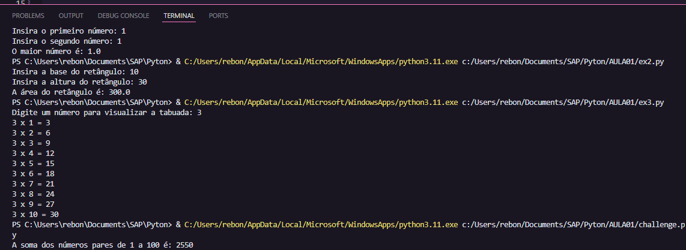

# Exercícios de Pseudocódigo

Este repositório contém exercícios básicos de lógica de programação em pseudocódigo e Python.

## 📂 Estrutura
- **Exercício 1** → Ler dois números e mostrar o maior.
- **Exercício 2** → Calcular a área de um retângulo.
- **Exercício 3** → Tabuada de um número.
- **Exercício 4** → Soma dos números pares de 1 a 100.

## 🖥 Como executar
No terminal:
```bash
python exercicio1.py

